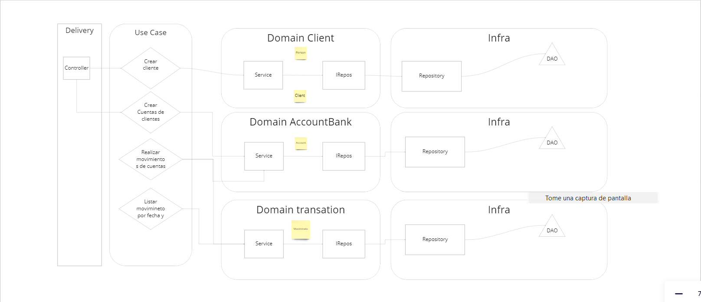

Bank Application

Se analizo el problema y en medida de obtar por una solucion optima y escalable se desarrollo implementando Clean Architecture y un poco de DDD, el cual sigue el siguiente flujo:

Tomando en consideracion el flujo anterior se llevo la distribucion del proyecto de la siguiente forma

Application: Donde estaran los casos de uso del app

Domain: Toda logica de negocio y entidades del sistema

Infra: Conexiones a base de datos y delivey siendo esta la ultima capa

Se implemento JAVA 17 spring 3.0.3 y base de datos relacion PostgresQl

Para llevar un codigo limpio y robusto se desarrollo el proyecto con la metorologia TDD

Pendientes:

-Implementar mas casos de uso tal como desactivar clientes, bloquear cuentas etc

-Separacion del dominio de las entidades del negocio con las entidades de la base de datos, aplicando un Mapper, garantizando asi un desacople completo de cualquier tecnologia de nuestra logica de negocio

